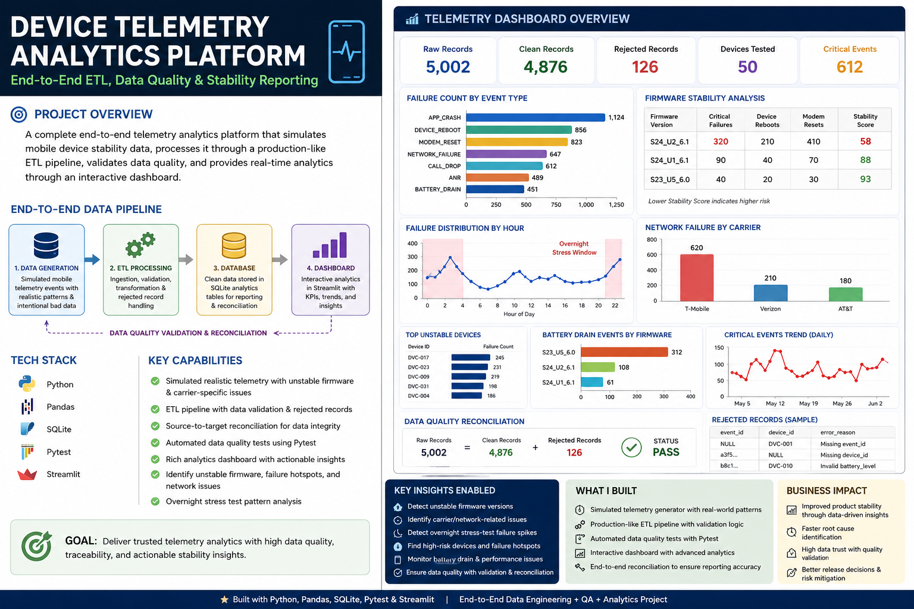

# Device Telemetry Data Pipeline & Reporting


End-to-end QA/Data Engineering project for mobile device stability telemetry.

## Tech Stack
Python, Pandas, SQLite, Pytest, Streamlit, SQL

## Features
- Simulated device telemetry data generation
- ETL ingestion into SQLite
- Clean and rejected record handling
- Data quality validation with Pytest
- Source-to-target reconciliation
- Streamlit dashboard for stability analytics

## Run Project

```bash
pip install -r requirements.txt
python src/generate_data.py
python src/ingest.py
pytest tests/test_data_quality.py -v
streamlit run dashboard/app.py